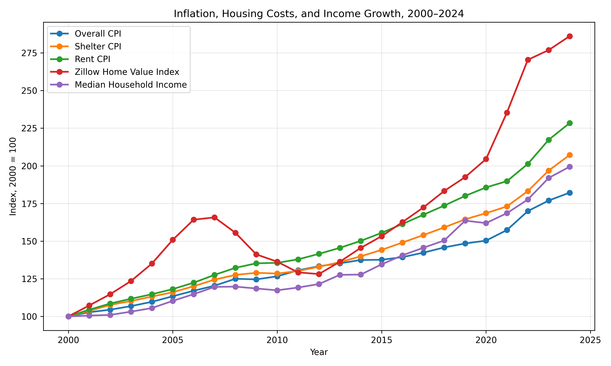
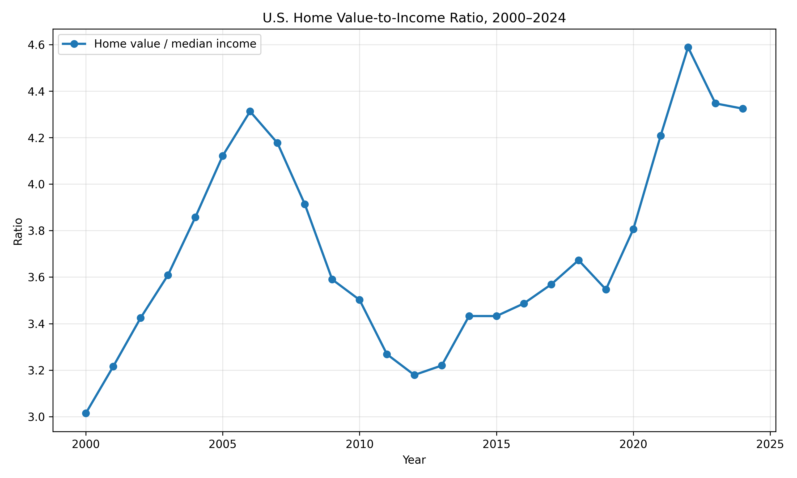
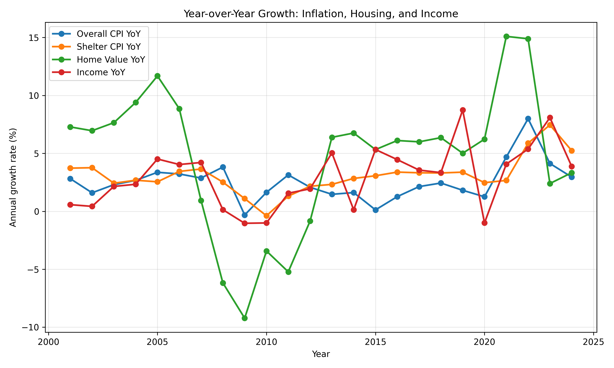

# US Inflation and Housing Cost Comparison

## Research Question

Have U.S. housing costs and home values grown faster than overall inflation and household income since 2000, and what does this imply for students and young renters?

## Data and Methods

This project uses publicly available economic data from FRED, Zillow/FRED, and Census/FRED for the period 2000–2024. The analysis includes CPI All Items, CPI Shelter, CPI Rent, Owners’ Equivalent Rent, Zillow Home Value Index, and median household income.

The workflow includes data downloading, cleaning, annual aggregation, normalized trend comparison, affordability ratio calculation, visualization, and exploratory OLS regression.

The main analysis ends in 2024 because the annual median household income series used in this project is only available through 2024. Some CPI and housing series may have newer observations, but including 2025 would make the income comparison and home value-to-income ratio incomplete.

## Main Findings

### 1. Housing costs grew faster than overall inflation

The normalized comparison shows that shelter-related costs and home values rose faster than the overall CPI.

This suggests that housing became a larger financial burden than general consumer goods over time.

### 2. Home values grew faster than income

The home value-to-income ratio increased over time, showing that the typical home became less affordable relative to household income.

The cleaned data shows that the ratio was about **3.81 in 2020**, increased to about **4.59 in 2022**, and remained above **4.3 in 2024**.

### 3. Housing growth was especially strong around the post-2020 period

The year-over-year growth chart shows that home value growth moved more sharply than CPI or income growth during some years, especially after 2020.

## Regression Results

Two exploratory OLS regressions were estimated.

**Model 1: Housing affordability gap over time**

The first model is:

`log(home value / median household income) ~ year`

The coefficient on year is positive and statistically significant. This supports the conclusion that the home value-to-income gap widened over time.

**Model 2: Home value growth vs. inflation and income growth**

The second model is:

`Home value YoY growth ~ CPI YoY growth + Income YoY growth + Post-2020 indicator`

This model is weaker statistically, so it should be interpreted as descriptive rather than causal.

## Why This Matters for Students

Students and young renters are particularly vulnerable to rising housing costs because they tend to have lower income, limited savings, and greater reliance on rental housing. As housing costs rise faster than income, students may need to live farther from campus, share housing with more roommates, work more hours while studying, or make educational and career choices based partly on housing affordability.

## Limitations

- The analysis is national-level and does not capture local housing markets.
- Zillow home values and shelter CPI measure different parts of housing costs.
- Student impact is inferred rather than directly measured using student-level data.
- The regressions are descriptive and do not establish causality.

## Conclusion

From 2000 to 2024, U.S. housing costs and home values grew faster than general inflation and household income. The evidence suggests a widening housing affordability gap, with especially important consequences for students and young renters. Overall, the project shows that housing affordability is not just part of general inflation—it is a distinct and growing economic challenge.